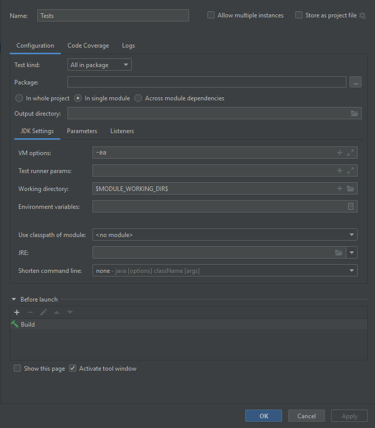

# NFT Trading exercise

## Tech used 

The test was written using Java & Selenium, the testing framework behind it is TestNG. Never used TestNG so I had to go 
through a guide on setting it up, I would very much recommend using this https://www.jetbrains.com/help/idea/testng.html
as well as copying my own test config 

After everything is set up the same way then it should all be straightforward, you should be able to run the test successfully.

## Potential issues

There are 2 major concerns I encountered while developing this solution and spent more time than I should trying to replicate them.

1. Upon signing in, we might get a popup asking if I want to get email updates, this happened once and never again, if it happens while 
executing the test, please click no thank you and after that it should work. Never had the chance to get the element identifiers to 
add an if statement to account for that, brushed it off first time I saw it thinking that if I go on incognito for the next runs it will 
reappear though it never happened.  
2. Running the app headless is **very** inconsistent. This has always been a problem with Selenium based apps, 90% chance there are waits that 
need to be added while executing every action. Though for the purpose of this exercise won't do that but accomodated a utility method that would
, reason this is not done here is because it takes hours of debugging to analyse what **exactly** you're waiting for and it seems out of scope. 
